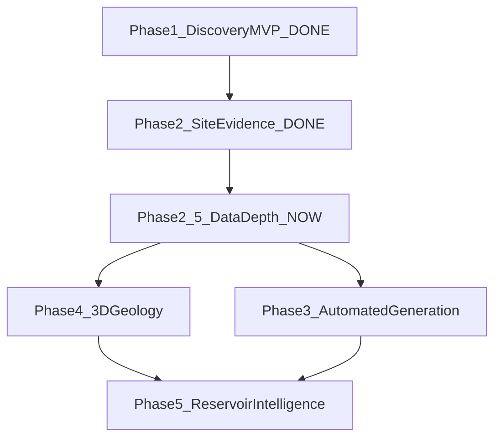

# Product Roadmap

**Thesis:** Actionable geothermal intelligence — not GIS.  
**Beachhead:** Texas / ERCOT · Next-gen geothermal discovery first.  
**Data strategy (authoritative for layers):** [data-strategy-texas-geothermal.md](data-strategy-texas-geothermal.md)  
**Data Depth judgment:** [reviews/2026-08-14-data-depth-continue/](reviews/2026-08-14-data-depth-continue/) · prior [reviews/2026-08-14-data-depth/](reviews/2026-08-14-data-depth/)

---

## Status snapshot (2026-08-14)

| Phase | Status |
|-------|--------|
| **1 — County discovery MVP** | **DONE** (thin thermal: IHFC + HIFLD) |
| **2 — Site evidence tools** | **DONE** (Point / AOI / Compare / Land context honesty) |
| **2.5 — Data Depth** | **STOP MET** (spine + TexNet + PAD-US frac>1%; RRC = accepted SMU proxy residual) |
| **3 — Automated opportunity generation** | **COMPLETE** (local watchlist / digest / rules / export) |
| **4 — 3D geology** | Deferred |
| **5 — Reservoir intelligence** | Deferred |

**Mandate:** Do not automate a weak thermal spine. Data Depth STOP cleared with labeled Stanford T@depth, SMU confidence, substations, TexNet, PAD-US Fee GAP1–2 **>1% area**, and a **written buyer-accepted SMU well-density proxy** (not RRC Digital Map). **Phase 3 COMPLETE** — [reviews/2026-08-14-phase3-complete/06-phase3-stop.md](reviews/2026-08-14-phase3-complete/06-phase3-stop.md). See Data Depth stop: [reviews/2026-08-14-data-depth-continue/05-stop-judgment.md](reviews/2026-08-14-data-depth-continue/05-stop-judgment.md).

---

## Phase 1 — Texas Geothermal Discovery MVP

### Goals

- Answer: *Where in Texas should I focus next-gen effort, and why?*  
- Ship explainable ranked zones + supporting map  
- Prove trust with transparent heuristics  

### Key features (shipped)

- Precomputed opportunity + confidence scores (v0.3.1)  
- Rank-first list + choropleth (cohort quarantine)  
- County detail (factors, drivers, sources)  
- Methodology page + county search  

### Data used

- IHFC GHFDB 2024 (gradient preferred / heat-flow fallback)  
- HIFLD transmission proximity  
- Census TX counties  

### Honest gap

~10 counties clear gradient min-n gate; most of Texas is heat-flow fallback. **Commercially insufficient as a standalone thermal spine.**

### Success criteria (historical)

- User produces focus/ignore shortlist in one session  
- Can explain ranks without a black box  
- Static public demo  

---

## Phase 2 — Site Evaluation Tools (shipped)

### Goals

- Move from regional discovery to **site / AOI evidence** without inventing a site score  
- Land-context honesty (ownership not in-app)  

### Key features (shipped)

- Point evidence check · AOI draw/upload · Compare ≤3 snapshots · Land context citations  
- Residual SOON polish closed (2026-08-14)  

### Explicitly not shipped

- Parcel / ownership GIS · interconnection feasibility · resource assessment  

See [phase2.md](phase2.md).

---

## Phase 2.5 — Data Depth (**STOP MET** — 2026-08-14)

### Goals

- Make screening **commercially useful** with practitioner-grade thermal + infra/offtake/risk context  
- Keep explainable heuristics; label model vs measured thermal  

### Posture after STOP

- **Live:** Stanford T@depth @4 km · SMU confidence · HIFLD lines+substations · TexNet caution · PAD-US Fee GAP1–2 **>1% area** · methodology v0.4 · residual UI  
- **Accepted residual:** D3 well-density = **SMU control proxy** (not RRC Digital Map) until MFT access  
- **Phase 3:** **COMPLETE** — [reviews/2026-08-14-phase3-complete/06-phase3-stop.md](reviews/2026-08-14-phase3-complete/06-phase3-stop.md)  
- Authoritative stop: [reviews/2026-08-14-data-depth-continue/05-stop-judgment.md](reviews/2026-08-14-data-depth-continue/05-stop-judgment.md)  
- Next-step review: [reviews/2026-08-14-build-review-next/00-judgment.md](reviews/2026-08-14-build-review-next/00-judgment.md)

### Build shipped (D1–D6 + M0)

| ID | Dataset / work | Score role |
|----|----------------|------------|
| **D1** | Stanford Thermal Earth Model (GDR 1592) — T@depth **4 km** TX county means | Opportunity (labeled **model prior**) |
| **D2** | SMU/GDR 1704 TX BHT / heat-flow points | **Confidence** densify |
| **D3** | Well density — **SMU proxy** (RRC Digital Map SOON) | Confidence / O&G co-use context |
| **D4** | TexNet catalog | Risk caution |
| **D5** | PAD-US Fee GAP1–2 (>1% area) | Friction gate |
| **D6** | HIFLD substations (+ lines) | Infra / offtake context |
| **M0** | Methodology **v0.4** | Live |

### Enhance SOON (post-STOP; not Phase 3 blockers)

| Item | When |
|------|------|
| Real RRC Digital Map density (replace SMU proxy) | When MFT/login works |
| Lund Snee / Zoback stress play factor | After EGS-aware posture is explicit |
| Point/AOI inherit labeled T@depth spine | **Shipped** (context only; not site score) |
| BEG OFM306 / finer geology | Only if a buyer asks |

### Defer — with when

| Dataset | When to build later |
|---------|---------------------|
| University Lands / GLO adjacency | Post–Phase 3 land workflow (new judgment) |
| Digitized geopressured fairways | After Gulf Coast play focus |
| Enverus / IHS BHT | After revenue or partner license |
| Phase 3 alerts / accounts | **Deferred** — local digest is the Phase 3 alert |

### Reject (still)

- Unlabeled ML suitability as MVP core  
- DIY statewide BHT→opportunity without QC program  
- Geology / IDW / basement **in ScreeningScore**  
- ERCOT CEII · parcel ownership GIS · silent interconnection claims  

### Success / stop criteria — **MET** (see stop judgment)

Phase 3 COMPLETE — scoped local cadence; auth/email/GLO need a new product judgment.

---

## Phase 3 — Automated Opportunity Generation

**Status:** **COMPLETE** · [phase3.md](phase3.md) · [reviews/2026-08-14-phase3-complete/06-phase3-stop.md](reviews/2026-08-14-phase3-complete/06-phase3-stop.md)

### Goals

- Return cadence when published scores/factors move  
- Explainable rule-based focus candidates  
- Still not a GIS product; Barnes geology remains a **must-have context overlay** (not a Phase 3 deliverable, not in score)

### Shipped (slice 1 + slice 2)

| ID | Deliverable |
|----|-------------|
| P3-1…P3-5 | publishId · watchlist ≤25 · digest · rules v0 · methodology |
| P3-6 | Auto-digest on panel open |
| P3-7 | Unit tests |
| P3-8 | Export/import JSON (confirm on replace) |
| P3-9 | Published score pack UX |
| P3-10 | TexNet badge + stable demote |
| P3-11 | Docs COMPLETE sync |

### Explicitly deferred (not Phase 3)

Accounts · push/email · GLO/parcels · CEII · ML prospects · new map layers · Point/AOI watch pins · economics  

### Success criteria — **MET**

- User maintains a watchlist, exports backup, sees versioned digest after refresh  
- Generated candidates follow frozen rules  
- No CEII / parcels / geology-in-score  

---

## Phase 4 — 3D Geological Modeling

### Goals

- Add subsurface spatial intelligence beyond 2D proxies  
- Support deeper technical diligence  

### Key features

- 3D well paths / temperature points  
- Simple stratigraphic or temperature volumes where data allows  
- Cross-sections tied to site dossiers  
- Integration with prior scores (3D as evidence, not vanity viz)  

### Dependencies

- High-quality well deviation / formation picks (often commercial)  
- WebGL / viz stack and performance budget  
- Domain partner for QC  

---

## Phase 5 — Reservoir Intelligence Platform

### Goals

- Reservoir- and operations-aware geothermal intelligence  
- Bridge prospecting → development support  

### Dependencies

- Phases 1–4 credibility · partnerships / data licenses · team beyond solo founder  

---

## Phase dependency graph

---

## What not to pull forward

| Temptation | Earliest phase |
|------------|----------------|
| T@depth + denser BHT | **2.5 (now)** |
| Stress / EGS play badges | 2.5 SOON |
| Alerts / accounts | 3 (after 2.5 stop) |
| GLO / University Lands diligence | 3 |
| Paid Enverus-class BHT | Post-revenue |
| Parcels / ownership GIS | Reject default / new judgment only |
| ERCOT CEII interconnection maps | Reject for public MVP |
| 3D | 4 |
| Reservoir / ML platform | 5 |
| National coverage | After TX trust + revenue signal |
