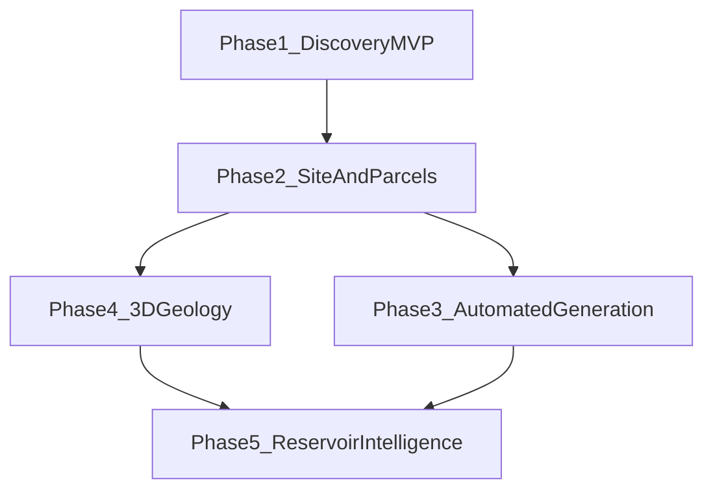

# Product Roadmap

**Thesis:** Actionable geothermal intelligence — not GIS.  
**Beachhead:** Texas / ERCOT · Next-gen geothermal discovery first.

---

## Phase 1 — Texas Geothermal Discovery MVP

### Goals

- Answer: *Where in Texas should I focus next-gen effort, and why?*  
- Ship explainable ranked zones + supporting map  
- Prove trust with transparent heuristics  

### Key features

- Precomputed opportunity + confidence scores  
- Ranked list + hotspot map  
- Zone detail (factors, drivers, sources)  
- Methodology page  
- Stretch: county/place search  

### Dependencies

- Public thermal proxy + RRC wells + ERCOT transmission extract  
- Locked play + JTBD ([DECISIONS.md](DECISIONS.md))  
- Scoring v0.1 ([scoring-methodology.md](scoring-methodology.md))  

### Success criteria

- User produces focus/ignore shortlist in one session  
- Can explain ranks without a black box  
- 3+ target developers give structured feedback  
- Deliverable in **30–45 days** for solo founder (see scope cuts in [tasks.md](tasks.md))  

### Technical challenges

- BHT quality and bias  
- Consistent spatial joins / CRS  
- ERCOT data licensing and refresh  
- Resisting layer sprawl  

---

## Phase 2 — Site Evaluation & Parcel Intelligence

### Goals

- Move from regional discovery to **site-level diligence support**  
- Reduce manual data collection for a known AOI  

### Key features

- Search / draw / upload AOI → structured dossier  
- Side-by-side comparison of 2–5 sites  
- Parcel / land context (start narrow: tax parcels or public land layers where available)  
- Richer infrastructure context (plants, substations detail)  
- Optional surface constraints (protected lands)  

### Dependencies

- Trusted Phase 1 factor model  
- Parcel data access/licensing (major)  
- Stable zone scoring for inheritance into AOIs  

### Success criteria

- User evaluates a candidate site without building a personal GIS  
- Comparison changes a go/no-go or priority decision  
- Dossier export (PDF/markdown) used in internal meetings  

### Technical challenges

- Parcel coverage inconsistency across Texas counties  
- On-the-fly spatial aggregation performance  
- Legal/ToS constraints on land data  
- Avoiding “cadastre product” distraction from geothermal thesis  

---

## Phase 3 — Automated Opportunity Generation

### Goals

- Proactively surface new/changed opportunities as data updates  
- Still explainable—automation ≠ black box  

### Key features

- Watchlists / alerts when ranks or factors move  
- Rule-based prospect generation (e.g. “thermal P80 + infra &lt; 15 km + confidence ≥ medium”)  
- Portfolio of tracked zones/sites  
- Economics-lite / interconnection context (not full LCOE)  

### Dependencies

- Phase 1–2 data pipelines with versioning  
- User accounts (first time auth may be justified)  
- Clear alert semantics to avoid noise  

### Success criteria

- Users return weekly without being pushed a map toy  
- Generated prospects pass human “not silly” review ≥ 80%  
- Documented methodology versioning for every alert  

### Technical challenges

- Pipeline reliability and data drift  
- Alert fatigue  
- Keeping generation rule-based and auditable  

---

## Phase 4 — 3D Geological Modeling

### Goals

- Add subsurface spatial intelligence beyond 2D proxies  
- Support deeper technical diligence  

### Key features

- 3D well paths / temperature points  
- Simple stratigraphic or temperature volumes where data allows  
- Cross-sections tied to site dossiers  
- Integration with prior scores (3D as evidence, not vanity viz)  

### Dependencies

- High-quality well deviation / formation picks (often commercial)  
- WebGL / viz stack and performance budget  
- Domain partner for QC  

### Success criteria

- 3D view changes a technical interpretation or confidence call  
- Not merely “looks cool” demos  

### Technical challenges

- Data gaps outside oilfield corridors  
- Solo-dev complexity explosion  
- Browser performance  
- Commercial data dependency  

---

## Phase 5 — Reservoir Intelligence Platform

### Goals

- Become the decision system for reservoir- and operations-aware geothermal intelligence  
- Bridge prospecting → development support  

### Key features

- Reservoir property frameworks (still explainable where possible)  
- Scenario comparison (closed vs open loop assumptions)  
- Integration with economic evaluation  
- Operator-grade reporting and portfolio risk views  
- Careful ML only where it beats heuristics **and** remains explainable  

### Dependencies

- Phases 1–4 credibility  
- Partnerships / data licenses  
- Team beyond solo founder  

### Success criteria

- Used in investment committee or partner diligence packs  
- Measurable reduction in time-to-shortlist and time-to-dossier  
- Expansion path beyond Texas justified by revenue/usage  

### Technical challenges

- Physics vs heuristics boundary  
- Liability and overclaiming  
- Multi-play, multi-basin ontology  
- Enterprise sales cycles  

---

## Phase dependency graph

---

## What not to pull forward

| Temptation | Earliest phase |
|------------|----------------|
| Parcels | 2 |
| AOI upload | 2 |
| Alerts / accounts | 3 |
| 3D | 4 |
| Reservoir / ML platform | 5 |
| National coverage | After Phase 1 trust (+ revenue signal) |
